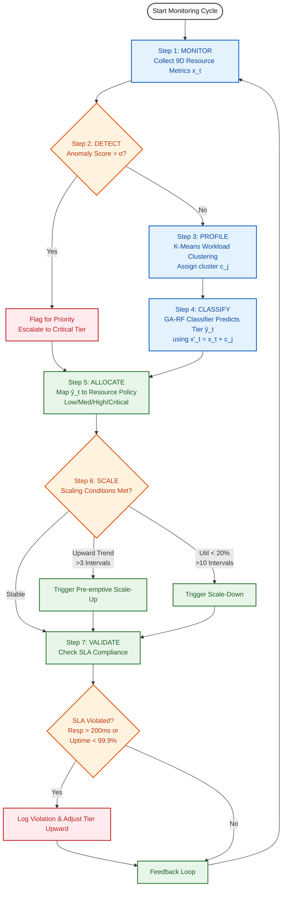

# AIRDA Framework: System Workflow Diagram

This document contains the end-to-end resource detection and allocation pipeline workflow for the **AIRDA Framework**, as described in the research paper.

## End-to-End Processing Pipeline

The pipeline executes the following 7 steps during every monitoring interval:

1. **MONITOR**: Collect Resource Metrics (CPU, Memory, Disk, Network, Task Queue, and temporal trends).
2. **DETECT**: Anomaly Identification using Enhanced RF.
3. **PROFILE**: K-Means Workload Clustering to assign a cluster label ($c_j$).
4. **CLASSIFY**: GA-RF Demand Prediction to predict the allocation tier (Low, Medium, High, Critical).
5. **ALLOCATE**: Policy-Driven Resource Mapping to allocate physical resources based on the tier.
6. **SCALE**: Dynamic Pre-emptive Scaling to scale up/down based on temporal patterns.
7. **VALIDATE**: SLA Compliance & Feedback Loop.

## Workflow Flowchart

